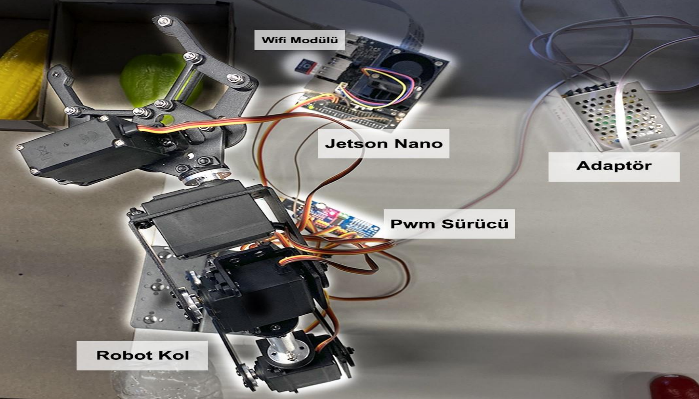
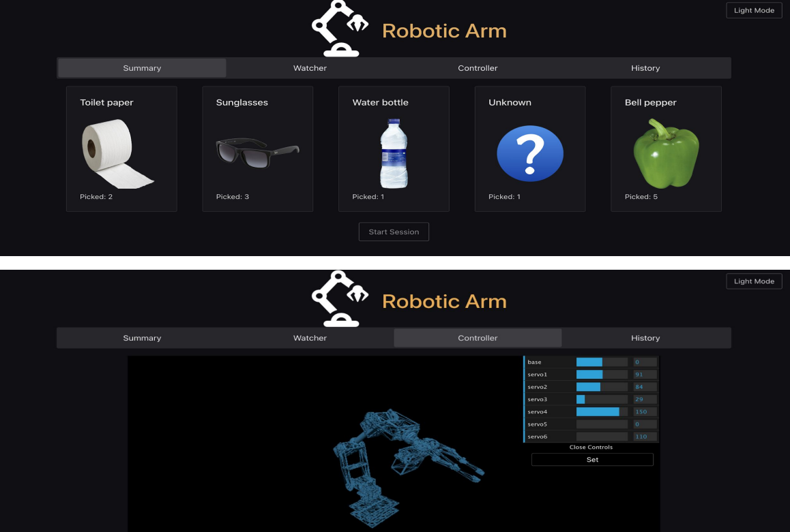
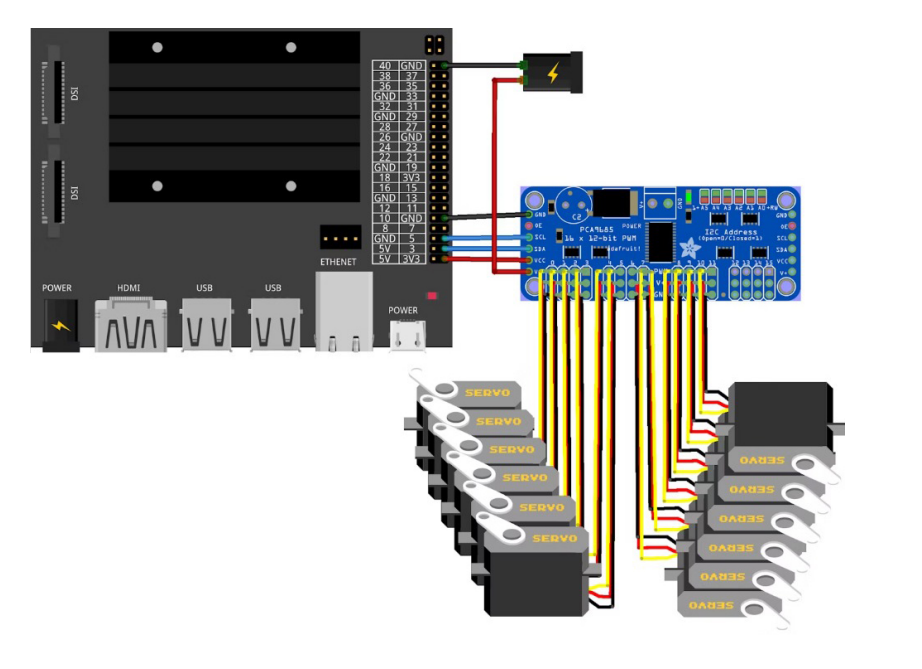

# TOBB University of Economics and Technology ELE 495 Robot Arm Project

## Description
The purpose of this project is to develop an object classification robot using a robotic arm and Nvidia Jetson Nano kit. This robot will utilize image processing and artificial intelligence technologies to identify and classify a specific number and variety of objects, then place them into respective bins, and display the entire process on a web interface.

## Features
- Object detection and classification using image processing algorithms.
- Integration of a robotic arm to handle and sort objects.
- Utilization of Nvidia Jetson Nano for real-time processing and AI capabilities.
- Web interface for monitoring and controlling the robot remotely.

## Requirements
- Nvidia Jetson Nano Developer Kit
- 6 axis robot arm 
- MIPI CSI-2 camera module
- MG996R servo motors
- WIFI module
- PCA9685 16 Channel I2C PWM/Servo Driver Board
- 12 V power supply

## Installation and Usage
1. Clone this repository to your Jetson Nano.
2. Connect the robotic arm and camera module to the Jetson Nano.
3. Configure the camera and robotic arm settings as needed.
4. Open a terminal and navigate to the project directory.
5. Run the main script using `app.py`.
6. Access the web interface from a browser to monitor and control the robot.

## Web Interface 

## Connections

## Acknowledgments
- Special thanks to Nvidia for providing the Jetson Nano Developer Kit.
- Thanks to the open-source community for their contributions to image processing.

## Contributors
- Abdullah Mert Büyükkıdan
- Burak Ceylan
- Numan Avcı
- Yaşar Can Kara
